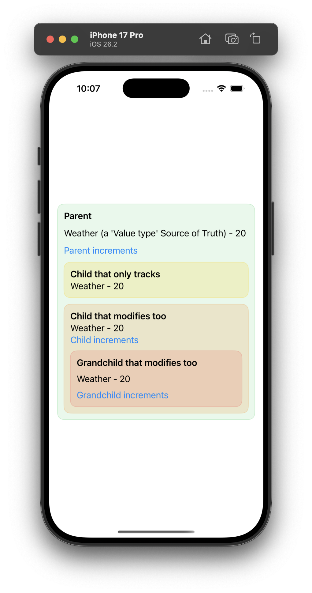
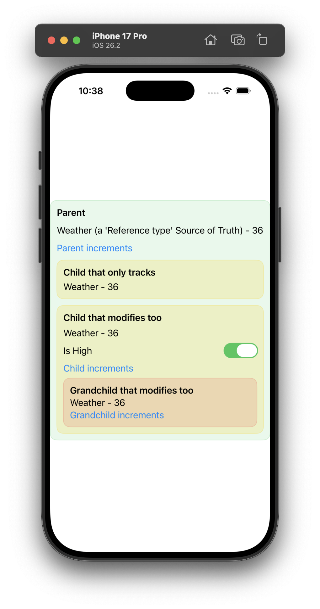

A companion project to [this](https://blog.anandkumarsingh.dev/posts/swiftui-data-management-property-wrappers) blog post. Its goal is to clearly show the SwiftUI state management interface as of iOS 26, the various property wrappers and macros. What to use and when.

| Canvas for testing value types                               | Canvas for testing reference types                           |
| ------------------------------------------------------------ | ------------------------------------------------------------ |
|  |  |